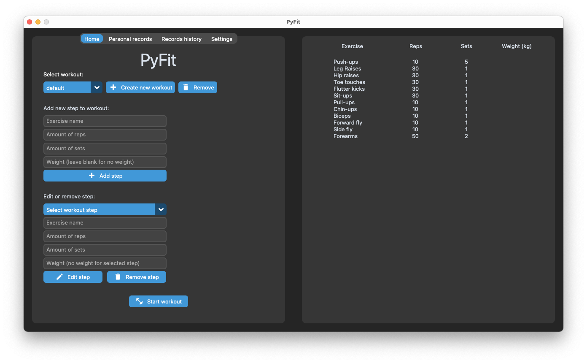

# PyFit
A Python app that displays your workout routine step by step. It shows you the current exercise and set, and it automatically adds a rest between each set.

On the rest screen, you can see what the next exercise will be.

You can add your own workout routines right inside the app.

    

    

    

# Requirements to build
You need `py2app` to compile the app yourself.

Use `pip install py2app` to install it.

From the root of the project folder, run `python setup.py py2app -A` in the terminal to compile the app in Alias mode. The app is ready to open and test in the `dist` folder.

If everything works fine, and you want to create a stand-alone version, you have to remove the build and dist folder (`rm -rf build dist`). Then run `python setup.py py2app` to build the app. The stand-alone build is available in the `dist` folder.
