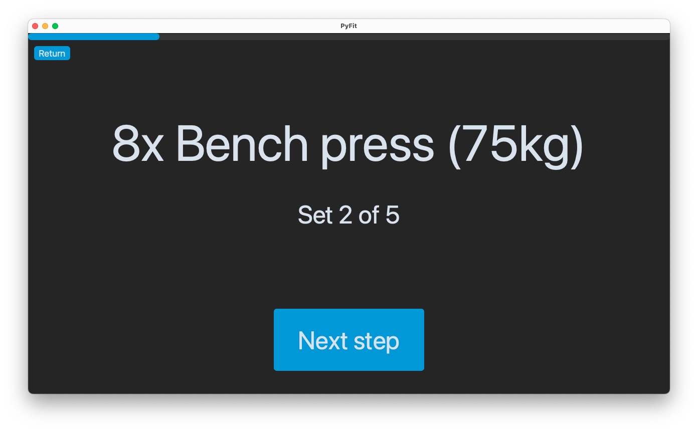

# PyFit

A Windows and macOS app that displays your workout routine step by step. It shows you the current exercise (with weight info), the current set, and it
automatically adds a rest between sets.

On the rest screen, you can see what the next exercise will be.

# Features

- Add and remove workouts
- Add steps, edit steps, or remove steps from a workout
- Overview of the workout step by step with step name, rep count, set count and weight
- Automatic rest screen between each step when doing a workout
- Progress bar on workout screen
- Statistics after finishing workout (total rep count and total volume)
- Personal records (will be available in v0.7.0)
- History graph of personal records to track improvements (will be available in v0.7.0)
- Dark theme and Light theme
- Settings
    - Choose between Dark theme, Light theme or follow system theme
    - Reset app
    - Check for updates
    - Import and export workouts

# Screenshots

    

| Dark theme                 | Light theme                |
|----------------------------|----------------------------|
|  |  |

    

    

    

    

    

    

    

# Steps to build for macOS

You need `py2app` to compile the app yourself.

Use `pip install py2app` to install it.

From the root of the project folder, run `python setup.py py2app -A` in the terminal to compile the app in Alias mode. The app is ready to open and test in
the `dist` folder.

If everything works fine, and you want to create a stand-alone version, you have to remove the build and dist folder (`rm -rf build dist`). Then
run `python setup.py py2app` to build the app. The stand-alone build is available in the `dist` folder.
